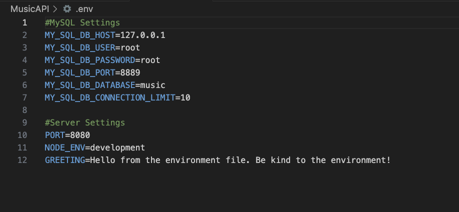

# Activity 1

- Andrew Rodriguez
- 7 September 2025

## Introduction
In the last activity, I built a simple Node.js web server using TypeScript. Now, I’ll refine it into the MusicAPI and improve how it’s built and executed. 

> [!Important] 
> Loom Link

 https://www.loom.com/share/dff1234d58f64102994344c88611b1d4?sid=382354f4-6488-4939-9a1d-c1ab6edb7253

 ## Environmental Variables
 - [.env File](../../MusicAPI/.env)

 Below are variables defined for the MySQL Database
 

 ## Database Initialization
 
 *Current Database entity relationships*

 ## API Entry Points
 |Method|Link|Browser Image|Postman Image|Path Variable / Body|
|--|--|--|--|--|
|GET|http://localhost:8080/albums|[Browser](../images/1-:albums.png)|[Postman](../images/1P.png)||
|GET|http://localhost:8080/albums/:artist|[Browser](../images/1-:albums:search.png)|[Postman](../images/2P.png)|artist="The Beatles"|
|GET|http://localhost:8080/albums/search/artist/:search|[Browser](../images/1-:albums:search:artist:search.png)|[Postman](../images/3P.png)|search="The"|
|GET|http://localhost:8080/albums/search/description/:search|[Browser](../images/:albums:search:description:search.png)|[Postman](../images/4P.png)|search="Please"|
|GET|http://localhost:8080/artists|[Browser](../images/1-:artists.png)|[Postman](../images/artistsP.png)||
|POST|http://localhost:8080/albums||[Postman](../images/postP.png)|[Create Album Request](createAlbum.json)|
|PUT|http://localhost:8080/albums/:albumId||[Postman](../images/putP.png)|[Update Album Request](updateAlbum.json)|
|DELETE|http://localhost:8080/albums/:albumId||[Postman](../images/delP.png)|albumId=26|

*System output for API requests and database connection*

## Conclusion

In the last activity, I built a simple Node.js web server using TypeScript. Afterwards, I improved it into the **MusicAPI** refining its structure and functionality. The project uses **Express** with a **Model-View-Controller (MVC)** pattern. In this case, the view is the data response received from client requests which helps keep the code organized and easy to maintain. The MusicAPI functions as a **RESTful API**, allowing clients to interact with server data in a standardized way. REST follows HTTP standards, characterized by stateless request and response cycles. Resources are represented as plural nouns in URIs, and actions are indicated through HTTP verbs. This method avoids mixing actions into URLs and results in scalable, clear, and professional API design, following best practices in web development and backend architecture.
