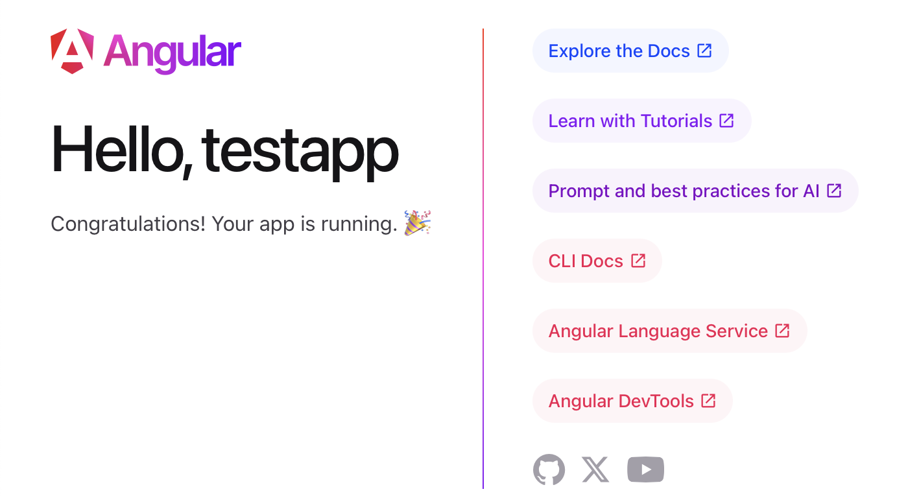
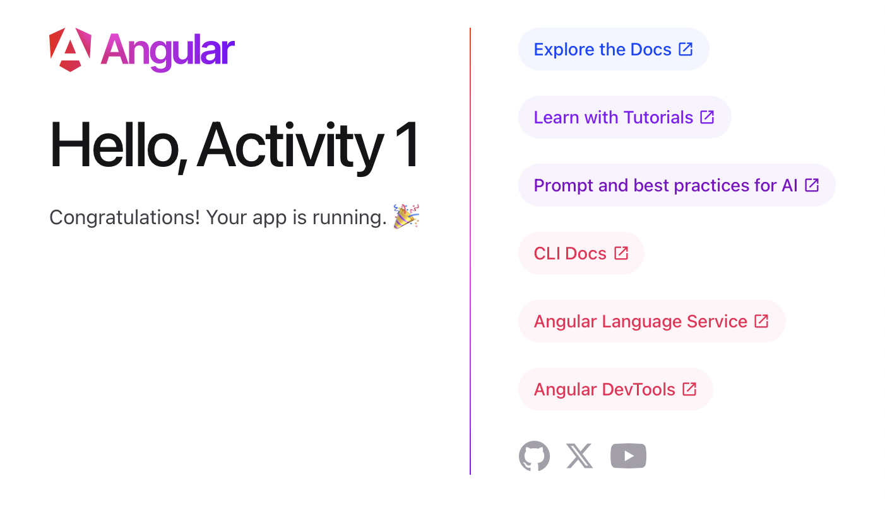
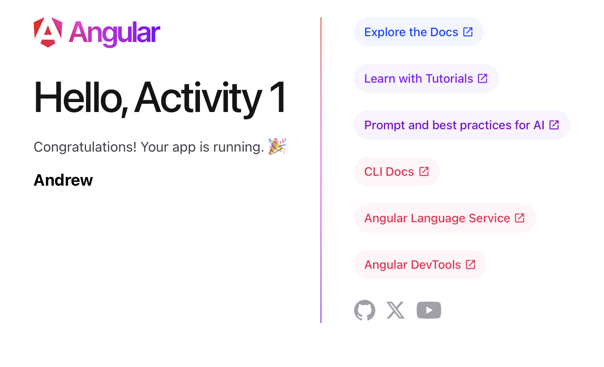

# Activity 2
- Andrew Rodriguez
- 14 September 2025

## Introduction

In this activity, I will install the required development tools for Angular and validate the setup by creating and running a simple test application. This exercise helps me confirm that my development environment is correctly configured and allows me to become familiar with the basic Angular workflow, including project creation, compilation, and viewing the application in a browser.
 

## Code Links
> [!IMPORTANT]  
> [testapp](../../testapp/)

## Application Demonstrations

*Figure 1: An angular page running on initial startup*

 

*Figure 2: The application title is changed to Activity 1*

 

*Figure 3: Displaying the message "Andrew" using a variable defined in the component (.ts) and rendered in the template (.html).*
  

## Conclusion

In this activity, I successfully installed and validated the Angular development environment by creating a simple test application. This exercise allowed me to confirm that the tools were correctly configured and provided me with hands-on experience in the basic Angular workflow, including project setup, component creation, and dynamic data binding between TypeScript and HTML templates. This foundation will prepare me for more advanced Angular development in future activities.

