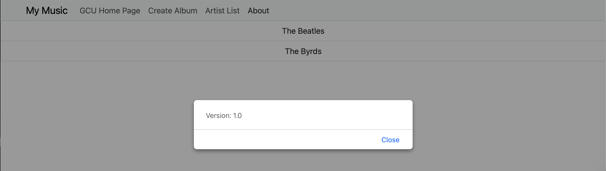

# Activity 3
- Andrew Rodriguez
- 21 September 2025
  
## Introduction
> [!Important]
> [Code](../../musicapp/)

In this activity, I developed the front end of a basic Music application by creating and implementing multiple components. I focused on handling various page events to make the application interactive and utilized data binding to connect the logic to the view templates. This process provided me with hands-on experience in structuring a front-end application, managing user interactions, and dynamically displaying data within the user interface.

# Part 1 - Simple App 

This section includes images from a simple test application to get familiar with Angular. You'll notice the col-sm and such tags throughout; this is not a bug. They are typed in that space and the idea is to show how the layout would continue on if those spaces were replaced with actual content, though we are using the col-sm-8 space.

 

*Figure 1: Demonstration of layout on a smaller phone device (iPhone Plus size)*
 

*Figure 2: Demonstration of layout on a larger tablet device (iPad 13-inch)*
 

*Figure 3: The initial screen user sees*
 

*Figure 4: The page updates based on the user input in the Name box upon clicking the 'Tell Me' button*
 

*Figure 5: The console shows that the 'Buy' button is working correctly and properly outputting the quantity entered for the selected movie*

## Part 2 - Music App

In Part 2 of this activity, I built the front end for a Music application using Angular. I implemented multiple components, handled page events, and used data binding to connect data to the view templates. This allowed me to create a more dynamic and interactive user experience. Building on what I learned in Part 1 with the simple test application and layout structure, this part helped me apply those concepts in a more practical and complex project, deepening my understanding of Angular’s component-based architecture and front-end development techniques.

 

*Figure 1: The initial screen the user sees which is a Welcome message and a nav-bar*

 

*Figure 2: This is the GCU Homepage the user is redirected to upon clicking the link in the navbar*

 

*Figure 3: The Create Album page the user sees when they want to create a new album and click the nav-bar link*

 

*Figure 4: This is the current Artist List; There is more data visible upon user making a selection (clicking an artist)*

 

*Figure 5: The about box displaying the version of the application*

## Conclusion

This activity provided me with hands-on experience in building a front-end application using Angular. In Part 1, I gained familiarity with Angular’s layout system and component structure through a simple test app. In Part 2, I applied these foundational skills to develop a functional Music application with multiple components, interactive elements, and dynamic data binding. Throughout the process, I enhanced my understanding of Angular’s framework, particularly how components communicate and respond to user actions. This activity has significantly strengthened my front-end development skills and better prepared me for future Angular projects and Milestone assignments.

