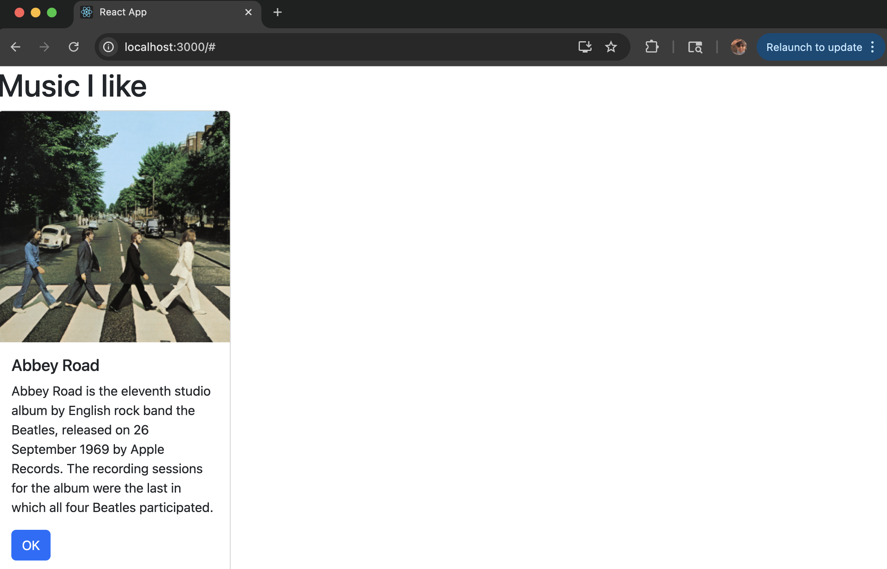
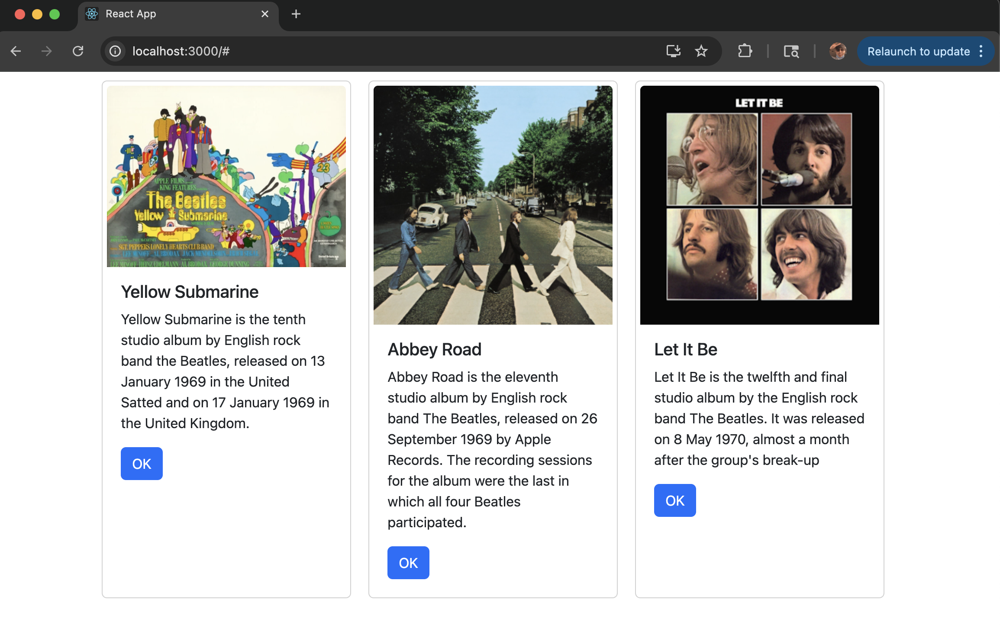

# Activity 5
- Andrew Rodriguez
- 5 October 2025

## Introduction

> [!Important]  
> Link to [Code](../../music/)  

In this activity, I explored the fundamental structure of a React application and how its different parts work together to display content on a webpage. The goal was to understand how React uses components, props, and state to build interactive user interfaces. By examining the index.js and App.js files, I learned how React elements are imported, rendered, and connected to the HTML root element. This exercise also introduced the concept of JSX, which combines JavaScript and HTML-like syntax, making React components easier to read and maintain. The activity sets the foundation for creating more dynamic applications by preparing to manage state and use event handlers within components.

## Screenshots

*Figure 1: The original card created in part 1 of the activity*

 

*Figure 2: The final product using state and props to render album information on cards*
 

## Conclusion

Through this activity, I gained a deeper understanding of how React organizes and manages data within web applications. I learned the importance of using components to keep code organized and reusable, and how props and state work together to make components dynamic and interactive. Watching how state updates instantly change the displayed content in the browser showed me React’s efficiency and reactivity. By applying these concepts in the music application, I successfully rendered multiple album cards and improved their data management. This activity reinforced the core principles of modern frontend development, giving me a strong foundation for building more complex and data-driven React applications in the future.