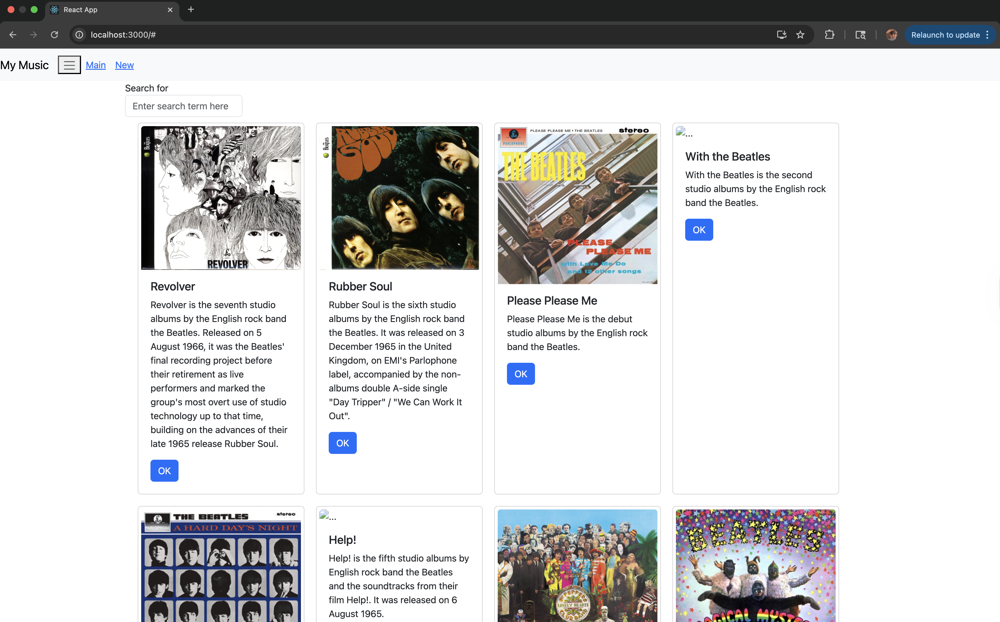
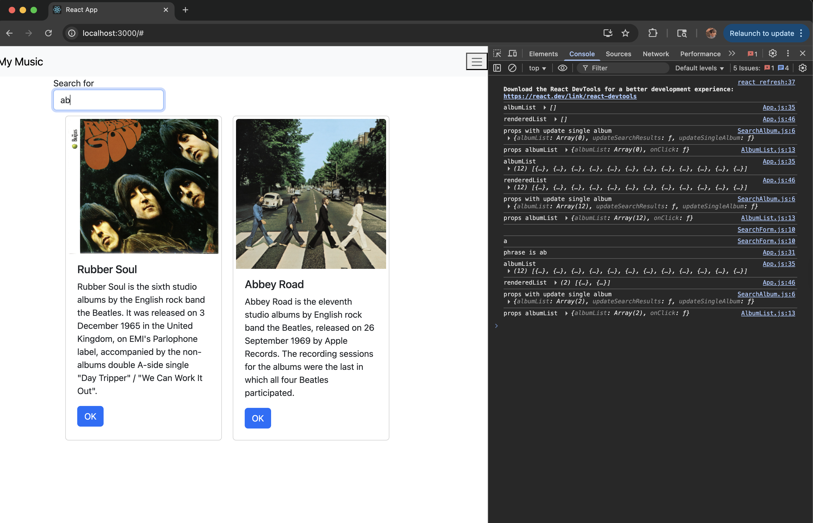

# Activity 6

- Andrew Rodriguez
- 12 October 2025

## Introduction
> [!NOTE]  
> This application is developed upon [Activity 5](../Activity%205/README.md) and uses the API created in [Activity 1](../Activity%201/README.md) to pull data from the MySQL database.  
> This application is still in development through the next few activities.

> [!IMPORTANT]  
> Quick link to [Code](../../music/)

In this activity, I continued developing the music application by improving its structure and organization. I began by moving the album list data out of the React component’s state and into an external file, setting up the foundation for later connecting to the Express Music API. I then installed the React Router library to prepare for implementing navigation within the app. Next, I refactored the code by replacing the `renderedList` helper function with a dedicated `AlbumList` component to better follow React’s component-based design principles. I also created a `SearchAlbum` component to combine the search and album display features, while simplifying `App.js` to manage state and pass data through its new child components.

## Screenshots

*Figure 1: The main screen for the application with components added in and pulling data from RestAPI Backend*

 

*Figure 2: Console shows what is happening when using the search component*

 

## Conclusion
In this activity, I enhanced the music application by adding several new features and improving its structure. The app now includes a fully integrated Express Music API for dynamic data retrieval, a search component for filtering albums, and a navigation bar to organize page access. I also implemented React Router to enable smooth navigation between routes. These updates improved modularity, usability, and functionality. Additionally, I was introduced to new terminology such as **Apollo**, a GraphQL client for managing data; **Axios**, a promise-based HTTP client for API requests; **Relay Modern**, a JavaScript framework for efficient data fetching in React; and **SuperAgent**, a lightweight AJAX library for making HTTP requests. Overall, this stage refined the app’s design and improved its interactive capabilities.
