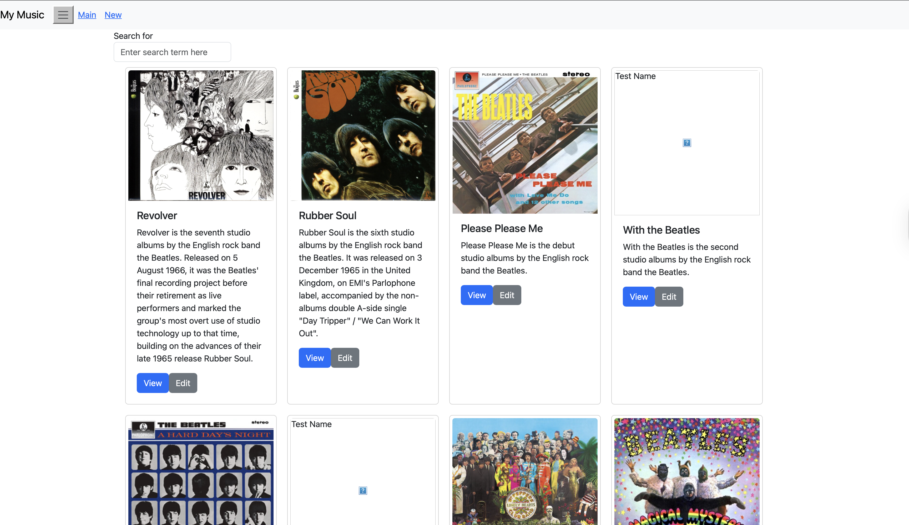
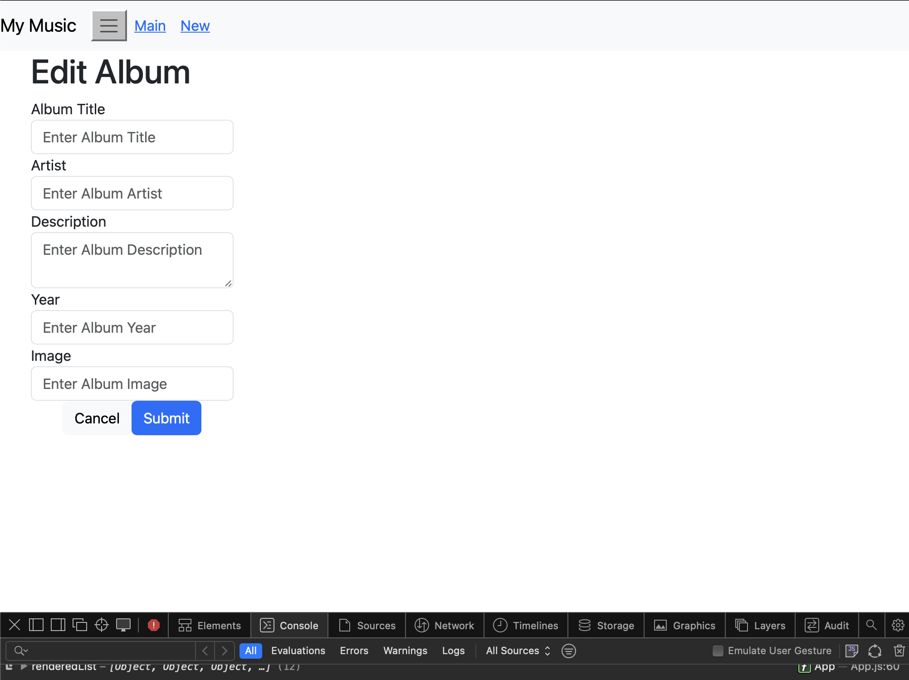

# Activity 7
- Andrew Rodriguez
- 19 Oct 2025

## Introduction
> [!NOTE]  
> This activity builds upon [Activity 6](../Activity%206/README.md).  
> Unfortunately, due to time constraints not all optional task were completed.

>[!IMPORTANT]  
> Quick link to [Code](../../music/)

In this activity, I continued developing the Music Application by enhancing functionality and improving component structure. Last week, the album list data was moved out of component state into an external file to prepare for Express API integration. React Router was installed for navigation, and components like AlbumList and SearchAlbum were added to simplify App.js and follow React’s component-based design.
This week, work focused on the OneAlbum component, adding tracks, lyrics, and video support with four additional child components. Dynamic track selection was implemented, and a form was created to add new albums. The NewAlbum component was refactored and renamed EditAlbum to handle both creating and editing albums, improving maintainability and avoiding code duplication.

## Screenshots

*Figure 1: Updated home screen with view and edit buttons*

*Figure 2: Shows the edit screen which updates the album view on the home screen*

## Conclusion
This week’s work advanced the Music Application by making the OneAlbum component more interactive and user-focused. Tracks, lyrics, and videos were integrated, supporting dynamic content updates when users select different songs. The album form was enhanced to allow both adding and editing albums through the refactored EditAlbum component, improving maintainability and reducing code duplication. These updates demonstrate the effective use of React’s component-based architecture, state management, and props for dynamic UI behavior. Overall, this milestone strengthens the app’s interactivity and sets a solid foundation for further features, such as improved album navigation, media playback controls, and enhanced user experience across the application.