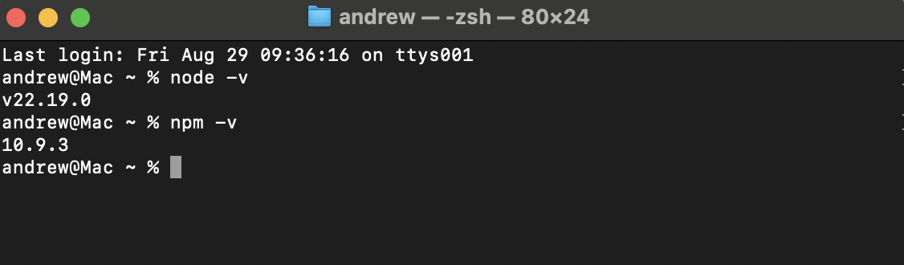
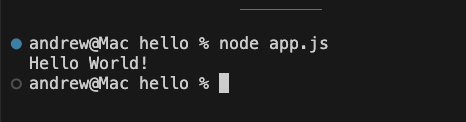
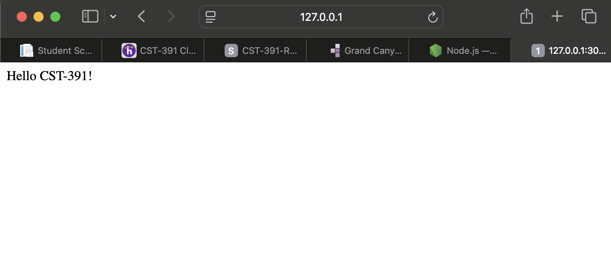
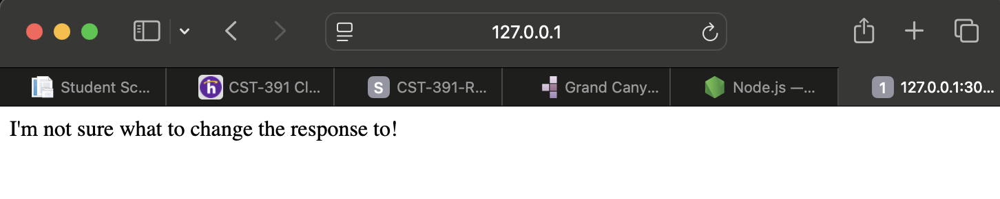
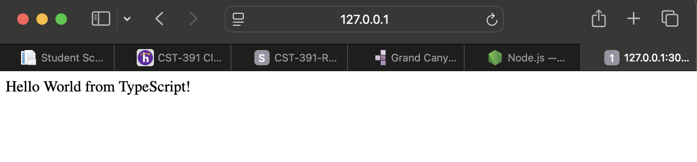
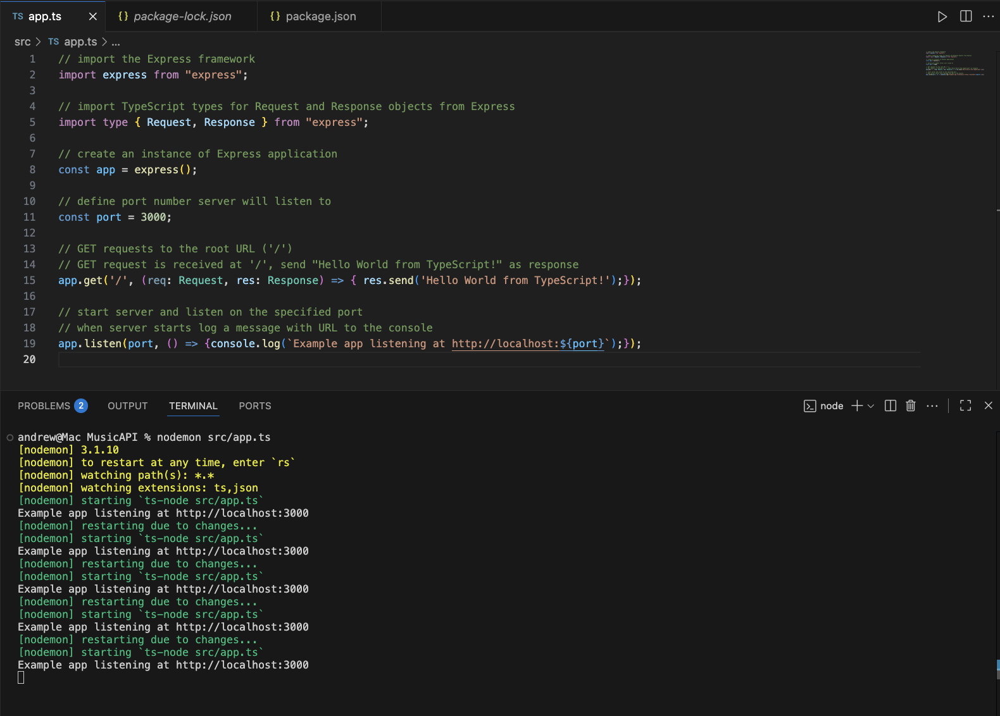

# Activity 0
- Andrew Rodriguez
- 7 September 2025

## Introduction
This activity installs Node.js, Express, TypeScript, and Visual Studio Code to build and run a simple Hello World applications.  

## Node and NPM versions

## NodeJS "Hello World" Application

## Express "Hello Express" Application

## Nodemon

## NodeJS with TypeScript "Hello TypeScript" Application

## Code

## Conclusion
In conclusion, this activity demonstrated installing essential tools and running a simple Hello World RESTful API using Node.js, Express, and TypeScript.  