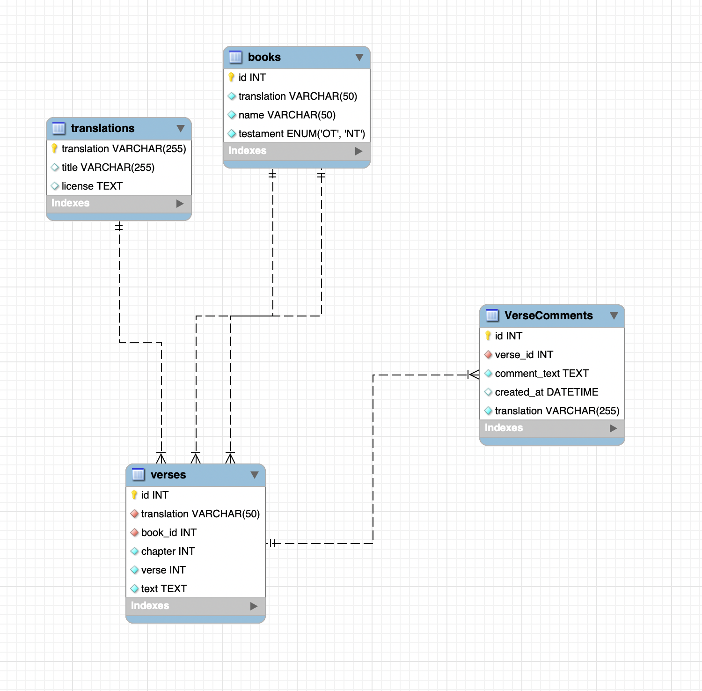

# Milestone 2
- Andrew Rodriguez
- 14 Sep 2025

## Instructor Feedback Updated
You've successfully met all the major requirements of the assignment, including using Markdown professionally, providing an introduction with functional requirements, an ER diagram for the backend, a sitemap with wireframes, a class diagram, and a discussion of project risks. The only item I see missing is a Conclusion, please add a Conclusion.

> [!IMPORTANT]
> View added [Conclusion](#conclusion)

## Introduction
> [!NOTE]
> This is refined upon [Milestone 1](../../Milestones/Milestone%201/README.md). 

Inclusion is a Christian-themed personal study web app that will allow users to create, read, update, and delete personal study notes tied to specific Bible verses and translations. The app is designed to help users engage with scripture, compare translations, and keep a personal record of their insights. For this proposal, the planned database will include a VerseComments table, and the REST API currently provides endpoints to get all comments, get a comment by ID, update a comment, and delete a comment. Create functionality will be added in future iterations.

## Functionality Requirements

- As a user, I want to view all Bible verses so I can select a verse to study.
- As a user, I want to search for verses by book, chapter, or keyword so I can
quickly find specific scripture.
- As a user, I want to view all comments for a selected verse so I can see others’
insights or my previous notes.
- As a user, I want to create a personal comment for a verse so I can record my
study notes.
- As a user, I want to edit my comments to update or clarify my insights.
- As a user, I want to delete my own comments so I can remove outdated or
incorrect notes.
- As a user, I want to filter comments by translation so I can compare insights
across versions like KJV and ACV.
- As a user, I want to view the details of a verse, including book, chapter, and
translation, so I have context for my comments.
- As a user, I want to see a list of my own comments in one place so I can review
my personal study notes efficiently.
- As a user, I want to sort comments by date so I can see my most recent notes first.
- As a user, I want to navigate easily between verses and comments so I can study
without confusion.
 

## Database Design: ER Diagram

**Tables and Fields**

**Relationships**
- books.id → verses.book_id (one-to-many)
- translations.translation → verses.translation (one-to-many)
- verses.id → VerseComments.verse_id (one-to-many)

## UI Sitemap (Text)

1. Home Page
    1. Browse Verses
        1. Verse Detail
            1. Comments (Create, Read, Update, Delete)
2. My Comments
    1. List of personal comments
        1. Edit/Delete options

3. About Page

## UI Wireframes (Text)

**Home Page**
- Header: Application Title (“Inclusion”)
- Navigation: Browse Verses, My Comments, About, and Admin
- Main Section: Welcome text and quick link buttons

**Browse Verses Page**
- Dropdowns: Select Translation, then Select Book, then Select Chapter, and finally Select
Verse.  
- Button: “View Verse”
- Below: Display the Verse Text.
- Comments Section: List of Comments, plus an “Add Comment” button.

**Verse Detail Page**
- Verse text in large font
- Comment box (textarea + submit)
- Existing comments with Edit/Delete buttons

**My Comments Page**
- List of users’ comments (table or cards)
- Actions: Edit, Delete

**About Page**
- Static text: Purpose of the app, Christian theme inspiration

## UML Classes (Text)
**Book**
- Attributes: id: int, translation: string, name: string, testament: enum(OT, NT)
- Methods: getBooks(), getBookById(id)
- Relationships: 1 Book → many Verses

**Translation**
- Attributes: translation: string, title: string, license: text
- Methods: getTranslations(), getTranslationById(id)

**Verse**
- Attributes: id: int, translation: string, book_id: int, chapter: int, verse: int, text: string
- Methods: getVersesByBook(book_id), getVerseById(id)
- Relationships: 1 Verse → many VerseComments

**VerseComment**
- Attributes: id: int, verse_id: int, comment_text: text, created_at: datetime, translation:
string
- Methods: addComment(c), updateComment(id, c), deleteComment(id),
getCommentsByVerse(verse_id)

**CommentService**
- Methods: createComment(data), readComment(id), updateComment(id, data),
deleteComment(id), listComments(verse_id)
 

## REST Endpoints
|Method|Endpoint|Description|Postman
|--|--|--|--|
|GET|/comments|Retrieve all comments|[Postman](./images/GET%20all.png)|
|GET|/comments/:id|Retrieve comment by id|[Postman](./images/GET%20id.png)|
|PUT|/comments/:id|Update comment by id|[Postman](./images/PUT.png)|
|DELETE|/comments/:id|Delete comment by id|[Postman](./images/DEL.png)|

## Risks
1. Database Schema Changes: Future modifications to the Bible verse or translation tables
could potentially disrupt CRUD operations or necessitate updates to the API.
2. Data Integrity: Ensure that user comments are accurately linked to verses and
translations, avoiding duplication or loss.
3. Front-end Integration: The Angular and React versions of the app may exhibit varying
behaviors when consuming the same API, potentially leading to inconsistencies.
4. User Authentication: If implemented later, authentication could introduce additional
complexity for comment creation, editing, and deletion.
5. Scalability: A large number of verses (approximately 500,000+) may slow down searches
or comment retrieval.
6. Cross-Translation Compatibility: Comparing and displaying comments across multiple
translations may necessitate additional logic and meticulous UI design.
7. Deployment & Environment Differences: Variations between development, testing, and
production environments could cause runtime errors ( Node version, TypeScript
configuration, MySQL setup).
8. Time Constraints: Completing both Angular and React front-ends and back-end services
may pose challenges within project deadlines.

## Conclusion

The Inclusion project proposal outlines a personal Bible study web application that enables users to engage with scripture and maintain personal verse comments across multiple translations. The backend design supports key CRUD operations through REST API endpoints, ensuring the application can efficiently manage user-generated content.
The proposed ER diagram, API design, and text-based sitemaps collectively demonstrate the structure, relationships, and functional flow of the system, providing a solid foundation for implementation and future development.