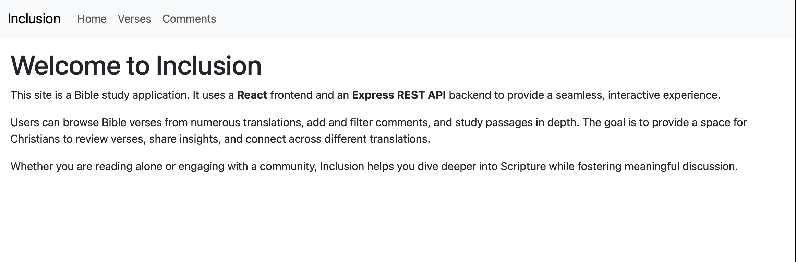
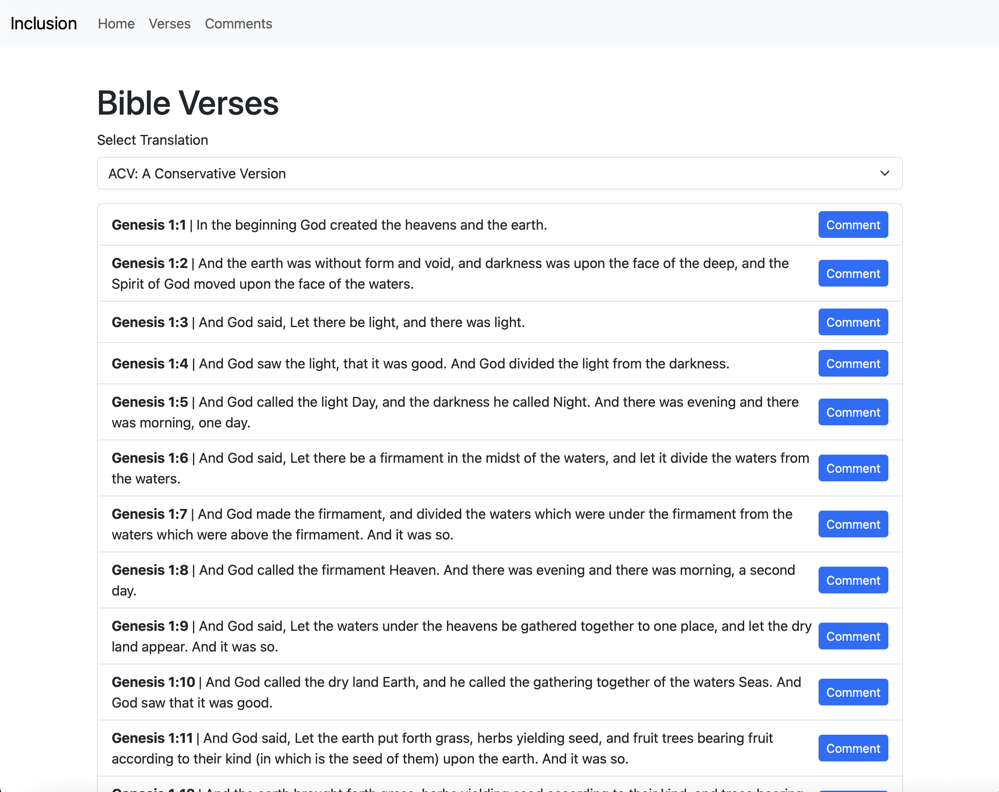
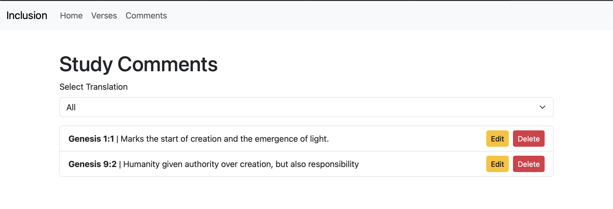
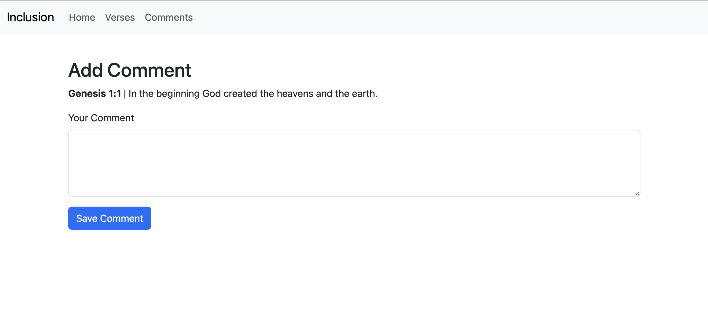
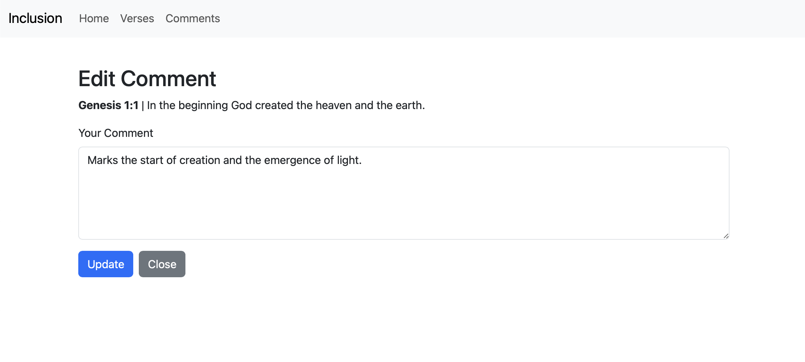
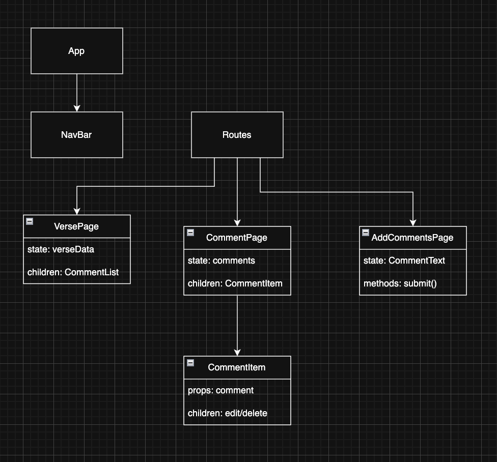

# Milestone 5
- Andrew Rodriguez  
- 19 Oct 2025  

## Introduction
> [!Note]  
> This builds upon [Milestone 3](../Milestone%203/README.md)  
> Quick link to [API Code](../InclusionAPI/)  
> Quick link to [Front-end Code](../Inclusionre/)  

> [!IMPORTANT]  
> View [Challenges, Issues, and Lessons Learned](#challenges-issues-and-lessons-learned)  
> Angular Front-End Demo: [Loom Link](https://www.loom.com/share/116e2bde603d4c4abf6e2bc24ffb7ff4?sid=2eff2943-e9a8-440c-85c3-55642bac3833)  
> View PowerPoint .PDF version here: [Milestone 5 PowerPoint](Milestone%205.pdf)  

Inclusion is a Christian-themed personal study web app that enables users to read, update, and delete personal study notes tied to specific Bible verses and translations. While Milestone 3 focused on implementing the REST API with Express/Node.js and MySQL, Milestone 5 integrates a **React front-end** with this backend. The Angular application now provides interactive navigation, UI components for viewing verses and comments, and the ability to perform CRUD operations directly in the browser. This marks the project’s first milestone with full-stack functionality.  

## Functionality Requirements
- As a user, I want to navigate a Home page to understand the purpose of the app and access key features.  
- As a user, I want to browse Bible verses through different translations.  
- As a user, I want to view, add, edit, and delete personal comments tied to specific verses.  
- As a user, I want to filter comments by translation for better comparison across versions.  
- As a user, I want to view a dedicated **My Comments** page showing all my study notes in one place.  
- As a user, I want to use the Angular interface for seamless, real-time interaction with the backend API.  

 

## Database Design: ER Diagram

## UI Sitemap

## UI Wireframes 
**Home Page**

**Books/Browse Page**

**My Comments Page**

**Add Comments Page Page**

**Edit Comments Page**

## UML 
**Front-end UML**

**Back-end UML**

## REST Endpoints
(Unchanged from Milestone 3, now consumed by React UI)  

|Method|Endpoint|Description|Postman
|--|--|--|--|
|GET|/comments|Retrieve all comments|[Postman](../Milestone%202/images/GET%20all.png)|
|GET|/comments/:id|Retrieve comment by id|[Postman](../Milestone%202/images/GET%20id.png)|
|GET|/verses/all?|Retrieve all translations|[Postman](../Milestone%202/images/GET%20translations.png)|
|POST|/comments|Create a new comment|[Postman](../Milestone%202/images/POST.png)|
|PUT|/comments/:id|Update comment by id|[Postman](../Milestone%202/images/PUT.png)|
|DELETE|/comments/:id|Delete comment by id|[Postman](../Milestone%202/images/DEL.png)|

## Risks
1. Front-end Integration: React required careful routing and component composition to align with backend endpoints.
2. UI/UX Consistency: Handling multiple translations and dynamic verse data introduced complexity in component state management.
3. Scalability: Rendering potentially large comment sets requires efficient filtering and pagination (pagination not yet included).
4. React Forms: Ensuring controlled components and validation worked properly for comment editing.

## Challenges, Issues, and Lessons Learned
During this milestone, most challenges were centered on React setup and routing. The edit-comment feature required aligning React state with form inputs and ensuring navigation between pages (Home, Browse Verses, Comments) worked consistently. A key lesson learned was structuring React components to cleanly separate data services (API calls) from UI logic. Integrating React with the existing API demonstrated the importance of consistent endpoint design and reusable services.

## Conclusion
With the completion of Milestone 5, Inclusion now provides a working React front-end integrated with the Express/Node.js backend and MySQL database. Users can browse verses, view details, and fully manage personal study comments in an interactive UI. This milestone marks the transition from backend-only functionality to a complete full-stack application, laying the foundation for improved user experience and future enhancements.